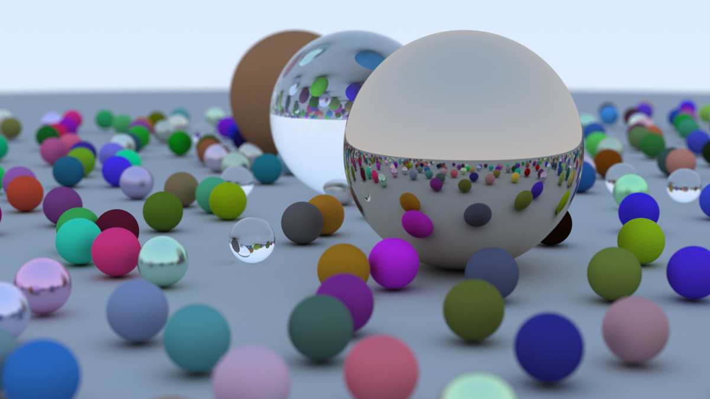

## Ray tracer in one weekend

Implementation of the ray tracer presented in the book [_Ray Tracing in One Weekend_](https://raytracing.github.io/books/RayTracingInOneWeekend.html), in Haskell.

Image generated by the ray tracer:



### How to run

```
stack run > image.ppm
```

The image generation can be sped up by using multiple cores, for instance 4 cores:

```
stack run --rts-options --rts-options -N4 > image.ppm
```

Note: the quality of the image can be improved via the camara parameter `cameraArgsSamplesPerPixel`. It works best with a power of 2.
